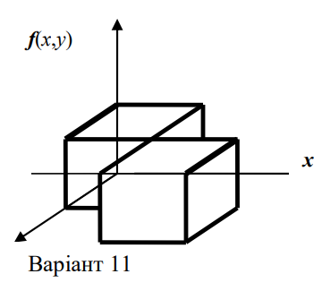
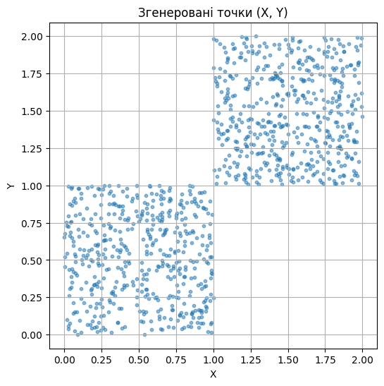
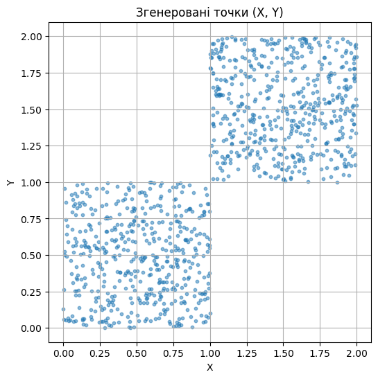

# Лабораторна робота №3

## Варіант



## Теоретична частина

### Аналітичне задання функції \( f(x, y) \)

Припустимо, що:

- Область 1: \( 0 \leq x \leq 1 \), \( 0 \leq y \leq 1 \)
- Область 2: \( 1 \leq x \leq 2 \), \( 1 \leq y \leq 2 \)

Тоді межі будуть такими:

$$
f(x, y) =
\begin{cases}
\frac{1}{2}, & \text (x, y) \in ([0,1]\times[0,1])\cup([1,2]\times[1,2]) \\
0,           & \text (x, y) \notin ([0,1]\times[0,1])\cup([1,2]\times[1,2]) \\
\end{cases}
$$

З цього виходить, що площа кожного прямокутника = 1, а їх дві, тому загальна площа підтримки = 2. Щоб \( f(x, y) \) була функцією щільності ймовірності, інтеграл по всій площині має дорівнювати 1.
→ \( \frac{1}{2} \cdot 2 = 1 \)

### Функція часткового розподілу \( \varphi(x) \)

```math
\varphi(x) = \int_{-\infty}^{\infty} f(x, y) \, dy
```

Розглянемо по частинах:

- Для \( x \in [0,1] \): \( f(x,y) = \frac{1}{2} \) при \( y \in [0,1] \)
  → \( \varphi(x) = \int_0^1 \frac{1}{2} \, dy = \frac{1}{2} \)

- Для \( x \in [1,2] \): \( f(x,y) = \frac{1}{2} \) при \( y \in [1,2] \)
  → \( \varphi(x) = \int_1^2 \frac{1}{2} \, dy = \frac{1}{2} \)

- В інших випадках: \( \varphi(x) = 0 \)

Отже:

\[
\varphi(x) = \begin{cases}
\frac{1}{2}, & x \in [0,1] \cup [1,2] \\
0, & x \notin [0,1] \cup [1,2]
\end{cases}
\]

### Умовна функція розподілу \( f_y(y/x) \)

\[
f_y(y/x) = \frac{f(x,y)}{\varphi(x)}
\]

Якщо \( \varphi(x) = \frac{1}{2} \), тоді:

- Для \( x \in [0,1] \), \( y \in [0,1] \):
  \[
  f_y(y/x) = \frac{\frac{1}{2}}{\frac{1}{2}} = 1
  \]

- Для \( x \in [1,2] \), \( y \in [1,2] \):
  \[
  f_y(y/x) = \frac{\frac{1}{2}}{\frac{1}{2}} = 1
  \]

- В інших випадках: 0

Тобто умовний розподіл рівномірний на відповідному квадраті.

### Математичне сподівання

Розглянемо:

- \( X \in [0,1] \) з густотою \( \frac{1}{2} \)
- \( X \in [1,2] \) з густотою \( \frac{1}{2} \)

\[
m_x = \int x \cdot \varphi(x) dx = \int_0^1 x \cdot \frac{1}{2} dx + \int_1^2 x \cdot \frac{1}{2} dx
= \frac{1}{2} \left[ \frac{x^2}{2} \right]\_0^1 + \frac{1}{2} \left[ \frac{x^2}{2} \right]\_1^2
= \\\ \frac{1}{2} \cdot \frac{1}{2} + \frac{1}{2} \cdot \left( \frac{4 - 1}{2} \right)
= \frac{1}{4} + \frac{3}{4} = 1
\]

Аналогічно \( m_y = 1 \)

### Середньоквадратичне відхилення

Спочатку знайдемо \( E[X^2] \):

\[
E[X^2] = \int x^2 \cdot \varphi(x) dx = \frac{1}{2} \int_0^1 x^2 dx + \frac{1}{2} \int_1^2 x^2 dx
= \frac{1}{2} \cdot \frac{1}{3} + \frac{1}{2} \cdot \left( \frac{8 - 1}{3} \right)
= \\\ \frac{1}{6} + \frac{7}{6} = \frac{8}{6} = \frac{4}{3}
\]

\[
\sigma_x = \sqrt{E[X^2] - (E[X])^2} = \sqrt{\frac{4}{3} - 1} = \sqrt{\frac{1}{3}} \approx 0.577
\]

Аналогічно \( \sigma_y = \sqrt{\frac{1}{3}} \)

### Коефіцієнт кореляції \( \rho \)

\[
\rho = \frac{E[XY] - E[X]E[Y]}{\sigma_x \sigma_y}
\]

\[
E[XY] = \int\int xy \cdot f(x,y) dx dy
\]

Обчислимо по двох квадратах:

- Перший: \( x, y \in [0,1] \)

\[
\int_0^1 \int_0^1 xy \cdot \frac{1}{2} dy dx = \frac{1}{2} \cdot \int_0^1 x \cdot \left( \int_0^1 y dy \right) dx
= \frac{1}{2} \cdot \int_0^1 x \cdot \frac{1}{2} dx = \\\ \frac{1}{4} \cdot \left[ \frac{x^2}{2} \right]\_0^1 = \frac{1}{8}
\]

- Другий: \( x, y \in [1,2] \)

\[
\int_1^2 \int_1^2 xy \cdot \frac{1}{2} dy dx
= \frac{1}{2} \cdot \int_1^2 x \cdot \left( \int_1^2 y dy \right) dx
= \frac{1}{2} \cdot \int_1^2 x \cdot \frac{3}{2} dx = \\\ \frac{3}{4} \cdot \left[ \frac{x^2}{2} \right]\_1^2 = \frac{3}{4} \cdot \frac{3}{2} = \frac{9}{8}
\]

Разом \( E[XY] = \frac{1}{8} + \frac{9}{8} = \frac{10}{8} = \frac{5}{4} \)

\[
\rho = \frac{\frac{5}{4} - 1}{\frac{1}{3}} = \frac{1}{4} \cdot \sqrt{3} \approx 0.433
\]

## Практична частина

### Програмний код (Python)

```python
import numpy as np
import matplotlib.pyplot as plt

n = 1000

# Є два квадрати: [0,1]×[0,1] і [1,2]×[1,2]
# Ймовірність потрапити в кожен з них — 0.5
samples = []

for _ in range(n):
    if np.random.rand() < 0.5:
        x = np.random.uniform(0, 1)
        y = np.random.uniform(0, 1)
    else:
        x = np.random.uniform(1, 2)
        y = np.random.uniform(1, 2)
    samples.append((x, y))

samples = np.array(samples)
x_vals = samples[:, 0]
y_vals = samples[:, 1]

# Обчислення експериментальних характеристик
mx = np.mean(x_vals)
my = np.mean(y_vals)
sx = np.std(x_vals, ddof=0)
sy = np.std(y_vals, ddof=0)
rho = np.corrcoef(x_vals, y_vals)[0, 1]

print(f"Експериментальне математичне сподівання: m_x = {mx:.4f}, m_y = {my:.4f}")
print(f"Експериментальне середньоквадратичне відхилення: σ_x = {sx:.4f}, σ_y = {sy:.4f}")
print(f"Експериментальний коефіцієнт кореляції: ρ = {rho:.4f}")

plt.figure(figsize=(6, 6))
plt.scatter(x_vals, y_vals, alpha=0.5, s=10)
plt.title("Згенеровані точки (X, Y)")
plt.xlabel("X")
plt.ylabel("Y")
plt.grid(True)
plt.axis("equal")
plt.show()
```

### Результати роботи

#### 1 прогін

> Експериментальне математичне сподівання: m_x = 1.0155, m_y = 1.0054
> Експериментальне середньоквадратичне відхилення: σ_x = 0.5760, σ_y = 0.5611
> Експериментальний коефіцієнт кореляції: ρ = 0.7375



#### 2 прогін

> Експериментальне математичне сподівання: m_x = 1.0234, m_y = 1.0162
> Експериментальне середньоквадратичне відхилення: σ_x = 0.5740, σ_y = 0.5920
> Експериментальний коефіцієнт кореляції: ρ = 0.7508



<script type="text/javascript" src="http://cdn.mathjax.org/mathjax/latest/MathJax.js?config=TeX-AMS-MML_HTMLorMML"></script>
<script type="text/x-mathjax-config">
    MathJax.Hub.Config({ tex2jax: {inlineMath: [['$', '$']]}, messageStyle: "none" });
</script>
